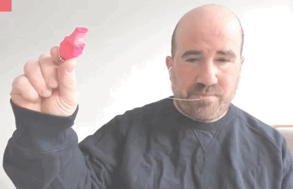
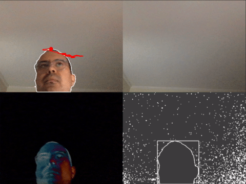
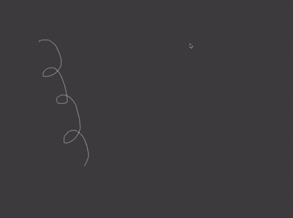
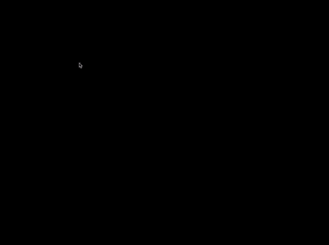
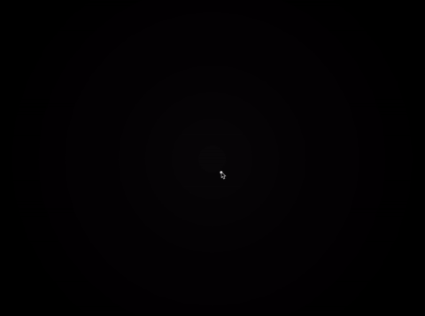

# MAS.S62 DrawingPlusPlus class notes

## About

* MAS.S62 is a class by Zach Lieberman
* Taught at MIT Media Lab, spring semester 2020
* Teaching assistant: Aarón Montoya-Moraga

The documentation of this class involves .gif files, which are generated from videos to GIF files using ffmpeg and the following command:

```bash
ffmpeg -i input.mov -filter_complex "[0:v] fps=10,scale=480:-1,split [a][b];[a] palettegen [p]; [b][p] paletteuse" output.gif
```

This command was adapted from the blog post "How to make GIFs with FFMPEG" at the blog "Giphy Engineering", and available at the link [https://engineering.giphy.com/how-to-make-gifs-with-ffmpeg/](https://engineering.giphy.com/how-to-make-gifs-with-ffmpeg/).

## Class 01: Tuesday February 18 2020

### Assignment for next class:

* Readings on shared Dropbox folder
* Install and setup [openFrameworks](https://openframeworks.cc/)
* Document all the drawings you encounter until next class.

### Setup of openFrameworks and this repository

* Go to [https://openframeworks.cc/](https://openframeworks.cc/)
* Download openFrameworks for your operating system, current version is 0.11.0.
* Unzip, and place the folder "of_v0.10.1_osx_release" in your home directory.
* Clone this repository [https://github.com/ofZach/MIT_DrawingPlusPlus](https://github.com/ofZach/MIT_DrawingPlusPlus) with the following command.

```zsh 
git clone "https://github.com/ofZach/MIT_DrawingPlusPlus.git"
```

* Place this repository inside of the folder apps/ on your openFrameworks.

* Whenever you want to update your local repository to the one on the cloud, use the command

```zsh
git pull
```

* The first time you build the project, it might take longer.

* If you have any doubts, please let us know on class, Slack, or come to office hours.

### Programming notes:

```cpp
// set background
ofBackground(0);

// draw a circle on mouse position if mouse is pressed
if (ofGetMousePressed()) {
  ofDrawCircle(mouseX, mouseY, 20);
}
```

If we need objects to be accesible across multiple frames or methods, we can declare them on the header .h file.

```cpp
// declare a line
ofPolyline line;
// draw a line
line.draw();
// delete a line
line.clear();
```

```cpp
// add random noise to a line
for (int i = 0; i < line.size(); i++) {
  line[i].x += ofRandom(-1, 1);
  line[i].y += ofRandom(-1, 1);
}
```

```cpp
// retrieve time
float time = ofGetElapsedTimef();
```

```cpp
// resample a line
ofPolyline resampled = line.getResampledBySpacing(10);
```

### Code examples

* basicDrawing: black background, white circles are drawn when the mouse is pressed. The circles remain forever.


* basicDrawing2: black background, white continuous line drawn on top, made with ofPolyline.


* basicDrawing3: black background, square shape drawn with a stroke made out of tiny red circles. This stroke is achieved by using a polyLine, resampling this line, and then drawing the resampled line using red circles.


## Class 02: Wednesday February 19 2020

### Taxonomy of drawings

* Intentional / unintentional
* Finished / in-progress / censored
* Permanent / intermitent
* Animal / nature
* One-glance / several glances
* Flat / several dimensions
* Utilitarian / non utilitarian

### Drawing exercise

* Each person takes a piece of paper, puts their name and the number 1 on it, and then writes a set of instructions for doing a drawing.
* Everyone swaps their paper with instructions.
* Each person takes a new piece of paper, and labels it with the same name on the piece of paper they got, and one number up.
* Follow the instructions and draw on your paper.
* Keep your paper with drawings and put the one you received on the shared pile.
* Everyone swaps their paper with drawings.
* Each person takes a new piece of paper, and labels it with the same name on the piece of paper they got, and one number up.
* Look at the drawing and come up with the rules that were followed when your drawing was done.
* Keep your paper with instructions and put the one you received on the shared pile.
* Keep on swapping and going from drawing to instructions back and forth.
* At the end, gather the pile of papers and reconstruct the sequences for each person.

### Geometry notes

A point in 2D can be defined in different ways:
* A pair of (x,y) coordinates measured from an origin (0,0), where x is horizontal position, y is vertical position.
* As a collection of (r,theta) coordinates measured from an origin (0,0), where r is distance, and theta is angle (measured in degrees, radians).

A line in 2D can be defined in different ways:
* The segment that goes from point (x1, y1) to point (x2, y2).
* The segment that goes from point (x1, y1) a distance r in angle theta (r, theta)

### Programming notes

### Code examples

* drawingPlayback: black background, a white line on top, and a white dot plays back the stroke motion.


* drawing3d: the cursor is drawing on the screen plane, and this plane is rotating while the drawing is happening, resulting in a three dimensional drawing.


* drawingBackwards: the drawing is made on the opposite direction of the movement of the mouse cursor, and the drawing follows the mouse around.


* drawingRendering: the drawing is made using the cursor, for every click the screen is cleared, and dragging stores the trajectory of the mouse in a mesh, which is rendered using grayscale for each new vertex and the color changes sinusoidally over time. 


* generativeExample1: the drawing is white lines over gray background, where in every iteration, a random starting point on an existing line is picked, and then a new line is drawn from it, with a random angle and random length, only if this new line does not intersect with existing lines.


### Assignment

Build a computational drawing tool -- either one that takes gesture as input or that's based on rules (translating rules into drawing commands.)

## Class 03: Thursday February 20 2020

### Drawing exercise

We divided in groups and used drawing as a way of understanding computation. The groups tackled these topics:

* QR code
* Logic gates
* Line drawing

### Code examples

* generativeExample2: the drawing is white lines over black background, where in every iteration a new line is drawn starting from a point in an existing line, using a random angle and a fixed distance, only if this new line does not intersect with existing lines.


* generativeExample3: the drawing is white lines over black background, where in every iteration a new line is drawn starting from a point in an existing line, choosing a random angle multiple of 45 degrees (0, 45, 90, 135, 180, 225, 270, 315) and a random distance, only if this new line does not intersect with existing lines.


* generativeExample4: the drawing is white lines over black background, where in every iteration a new line is drawn starting from a random point in an existing line, choosing a random angle and a random distance. The new line is drawn only until it intersects with an existing line and only if this new line is larger than a threshold.


* generativeExample5: the drawing is white lines over black background, where in every iteration a new line is drawn starting from a random point in an existing line, choosing a random angle which is almost perpendicular (+90 or -90 degress plus a bit of noise). The new line is drawn only until it intersects with an existing line and only if this new line is larger than a threshold.


### Assignment

Make the largest possible drawing and the smallest possible drawing you can.

## Class 04: Friday February 20 2020

### Code examples

* generativeExample6: the drawing is white lines over black background, where in every iteration a new line is drawn starting from a random point in an existing line, choosing a random angle close to the original angle of the line. The line is drawn with a gradient color, going from fully opaque white in the start point to fully transparent in the end point. The new line is drawn only if it does not intersect with existing lines.


* node: the drawing is a white line over gray background. There is a node on the middle of the canvas, which is connected to a moving node in a fixed distance, and this one is also connected to another one at a fixed distance. This last node is the one that draws a line as a result of leaving a trace of its trajectory while the canvas moves to the left.


## Class 05: Tuesday March 31 2020 (remote)

In this class we used two openFrameworks addons:

* [ofxCv](https://github.com/kylemcdonald/ofxCv): alternative approach to interfacing with OpenCv from openFrameworks.
* [ofxFaceTracker2](https://github.com/HalfdanJ/ofxFaceTracker2): face detection and face landmark detection algorithm from [dlib](http://dlib.net/).

The convention for openFrameworks addons is that their names start with the prefix ofx, so by searching "ofx" on GitHub you will be able to find plenty. Also, there is an index compiled from GitHub and separated by categories at [https://ofxaddons.com/](https://ofxaddons.com/).

To add both of these ofx addons to your openFrameworks installation, we suggest using the terminal to go to the addons/ folder and then cloning the GitHub repositories with the commands:

```bash
git clone https://github.com/kylemcdonald/ofxCv.git
git clone https://github.com/HalfdanJ/ofxFaceTracker2.git
```

ofxFaceTracker2 needs a ~100 MB dependency, which is a file with face landmarks for their detection. The repository has instructions for manually downloading, and also has a .sh script called "download-model.sh" which makes this process automatic.

If you want to use the automatic process, you need to cd into addons/ofxFaceTracker2/ and execute the download-model.sh file on the terminal using the command:

```bash
sh download-model.sh
```

This command will download the compressed file, extract the ~100MB file "shape_predictor_68_face_landmarks.dat" and store it in addons/ofxFaceTracker2/model/

The manual option is downloading the file from the link [http://sourceforge.net/projects/dclib/files/dlib/v18.10/shape_predictor_68_face_landmarks.dat.bz2](http://sourceforge.net/projects/dclib/files/dlib/v18.10/shape_predictor_68_face_landmarks.dat.bz2), and then uncompressing in order to extract the ~100MB file "shape_predictor_68_face_landmarks.dat", and storing it in the folder addons/ofxFaceTracker2/model/.

This uncompressed file needs to be inside of the folder bin/data/model/ of any app that depends on ofxFaceTracker2. In this class, this will only be needed on the cvFaceDraw example. This can be achieved manually, but we suggest using the openFrameworks projectGenerator app found in your oF installation.

If your cvFaceDraw app is not running because this file cannot be found, we suggest manually moving it one folder up from bin/data/model to bin/data/ and trying again.

### Code examples

* cvColorTracker: this example looks for a color and then looks up the biggest blob with that color and draws the contour of it.



* cvContourTracker: this example features background substraction and contour detection. The image is divided in four corners: top left is the camera input with a red dot on the upper point of the biggest contour and a red line with the trail of it, top right is the last recorded background, bottom left is the difference image between camera input and background, bottom right is the contour finder detected by computer vision. The keyboard controls are spacebar to save the background image, and the letter "l" to reset the red line.



* cvFaceDraw: this example features computer vision and face tracking using ofxFaceTracker2 addon. When there is a face detected, the outlines of both eyes are drawn in white, and each eye leaves a trail of its position, left eye using green and red eye sugin red. Whenever any key is pressed on the keyboard, both trails are reset and we can draw new ones.


### Related artists and artworks

* [Maya Man](https://mayaontheinter.net/): creates work with dancing, machine learning, internet.
  * [Body, Movement, Language: A.I. Sketches with Bill T. Jones](https://mayaontheinter.net/billtjones/)
  * [Paint me in pixels so I can dance forever](https://mayaontheinter.net/paintme/)
* [Andreas Refsgaard](https://andreasrefsgaard.dk/) creates work with computer vision, machine learning and interactivity
  * [Doodle Tunes](https://andreasrefsgaard.dk/project/doodle-tunes/)
  * [An algorithm watching a movie trailer](https://andreasrefsgaard.dk/project/an-algorithm-watching-a-movie-trailer)

## Class 06: Tuesday April 07 2020 (remote)

### Code examples

* mixDrawings: This example features linear interpolation between lines. The drawing settings are white lines over gray background. You can draw a new white line with mouse press and dragging, and at any given time, the app only displays the most recent two drawn lines, plus a third line which bounces back and forth between the two that you have drawn, doing a linear interpolation between them, which is achieved by resampling both of the original lines using the same samping size.



* angleLengthLine: this example features lines curling and uncurling. The drawing settings are white lines over black background. You can draw a new white line with every mouse press and dragging. At any give ntime, the app displays all the lines drawn so far, which go from their original state, through being a straight line, and becoming their opposite in terms of curvature. This is achieved by thinking of every line as a succession of straight lines, and manipulating the relative angles between them, oscillating between their original value and the complementary one, becoming a straight line in between.



* springDrawing:



* CLDtoDrawing:


### Assignment

Make a tool that makes a drawing come to life, that animates it in some way.

### Related software

* [clmtrackr.js](https://github.com/auduno/clmtrackr): an open source JavaScript library for facial features tracking on the browser.
* [ml5.js](https://ml5js.org/): an open source library for artificial intelligence web applications, built on top of tensorflow.js, developed at NYU ITP.


## Class 07: Tuesday April 14 2020 (remote)

## Class 08: Tuesday April 21 2020 (remote)

## Class 09: Tuesday April 28 2020 (remote)

## Class 10: Tuesday May 05 2020 (remote)

## Class 11: Tuesday May 12 2020 (remote)
