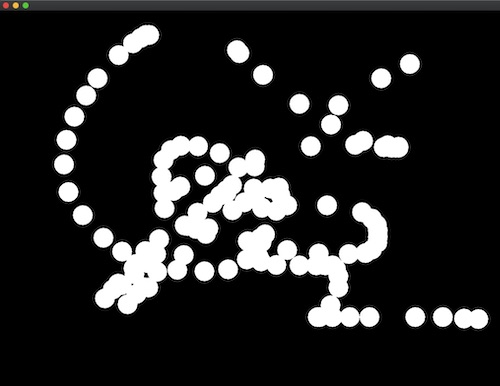
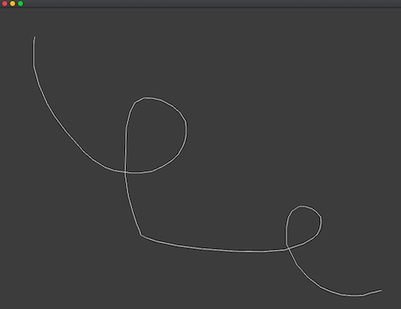
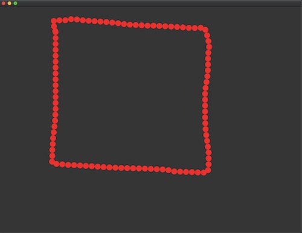

# Notes from class MAS.S62 DrawingPlusPlus, by Zach Lieberman

## Class 1: Tuesday February 18 2020

### Assignment for next class:

* Readings on shared Dropbox folder
* Install and setup [openFrameworks](https://openframeworks.cc/)
* Document all the drawings you encounter until next class.

### Setup of openFrameworks and this repository

* Go to [https://openframeworks.cc/](https://openframeworks.cc/)
* Download openFrameworks for your operating system, current version is 0.11.0.
* Unzip, and place the folder "of_v0.10.1_osx_release" in your home directory.
* Clone this repository [https://github.com/ofZach/MIT_DrawingPlusPlus](https://github.com/ofZach/MIT_DrawingPlusPlus) with the following command.

```zsh 
git clone "https://github.com/ofZach/MIT_DrawingPlusPlus.git"
```

* Place this repository inside of the folder apps/ on your openFrameworks.

* Whenever you want to update your local repository to the one on the cloud, use the command

```zsh
git pull
```

* The first time you build the project, it might take longer.

* If you have any doubts, please let us know on class, Slack, or come to office hours.

### Programming notes:

```cpp
// set background
ofBackground(0);

// draw a circle on mouse position if mouse is pressed
if (ofGetMousePressed()) {
  ofDrawCircle(mouseX, mouseY, 20);
}
```

If we need objects to be accesible across multiple frames or methods, we can declare them on the header .h file.

```cpp
// declare a line
ofPolyline line;
// draw a line
line.draw();
// delete a line
line.clear();
```

```cpp
// add random noise to a line
for (int i = 0; i < line.size(); i++) {
  line[i].x += ofRandom(-1, 1);
  line[i].y += ofRandom(-1, 1);
}
```

```cpp
// retrieve time
float time = ofGetElapsedTimef();
```

```cpp
// resample a line
ofPolyline resampled = line.getResampledBySpacing(10);
```

### Code examples

* basicDrawing: black background, white circles are drawn when the mouse is pressed. The circles remain forever.



* basicDrawing2: black background, white continuous line drawn on top, made with ofPolyline.



* basicDrawing3: black background, square shape drawn with a stroke made out of tiny red circles. This stroke is achieved by using a polyLine, resampling this line, and then drawing the resampled line using red circles.



## Class 2: Wednesday February 19 2020

### Taxonomy of drawings

* Intentional / unintentional
* Finished / in-progress / censored
* Permanent / intermitent
* Animal / nature
* One-glance / several glances
* Flat / several dimensions
* Utilitarian / non utilitarian

What is the boundary of drawing?

## Class 3: Thursday February 20 2020

## Class 4: Friday February 20 2020
